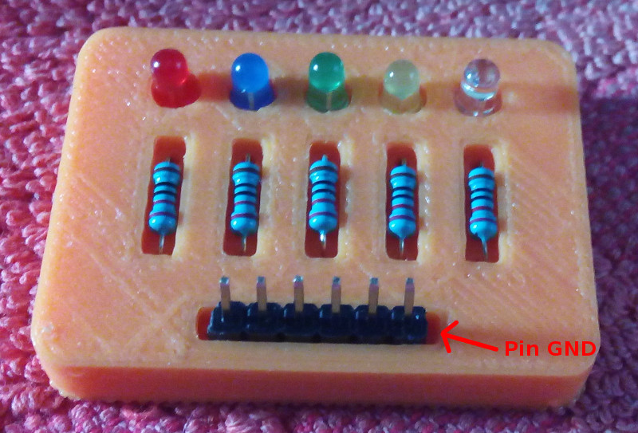

# PCBPrint 5 Led

Esta PCBPrint consta de 5 leds de ánodo común a GND pensado especialmente para placas como IceZum Alhambra, Arduino y similares.

Todas las conexiones se pueden realizar con las propias patillas de las resistencias y de los leds excepto la unión de los ánodos de los leds a GND en el que habrá que añadir un pequeño alambre como se muestra en la figura.

Descargas:
[pcb-5-led.fcstd](../fcstd/pcb-5-led.fcstd) - [pcb-5-led.stl](../stl/pcb-5-led.stl)
